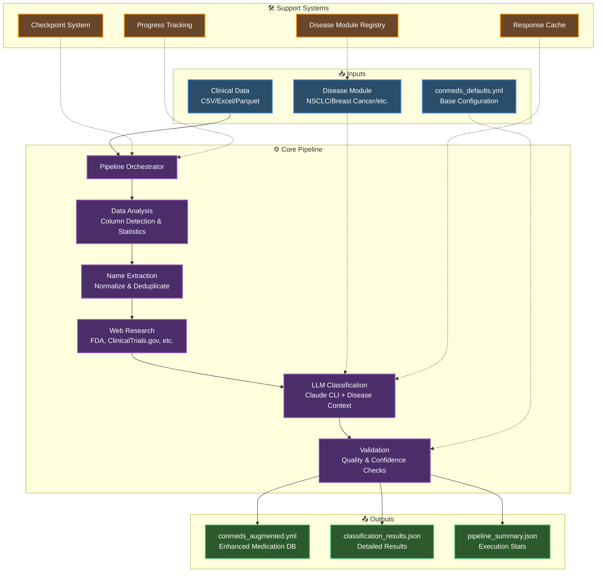

# 💊 Medication Augmentation System

## 🎯 Overview

The Medication Augmentation System is a flexible, modular framework that automatically expands `conmeds_defaults.yml` configuration files for any disease indication. It captures comprehensive generic and brand names for each drug class, improving medication matching accuracy in clinical data processing pipelines across multiple therapeutic areas.

**Currently Supported Diseases:**
- **NSCLC** (Non-Small Cell Lung Cancer) - Primary implementation
- **Extensible Architecture** for additional diseases (breast cancer, prostate cancer, etc.)

## ❗ Problem Statement

Clinical research across therapeutic areas faces common challenges with medication enrichment processes that rely on manually curated `conmeds_defaults.yml` files with limited medication name coverage, resulting in:

- **Low medication matching rates** - Missing many medication variations found in clinical datasets
- **Manual bottlenecks** - Data scientists spend significant time manually reviewing medication lists
- **High false negative rates** - LLM classification without disease-specific context misses therapeutic area medications
- **Scalability issues** - Each new disease requires separate manual curation efforts

## ✅ Solution

A modular, disease-agnostic automated pipeline that intelligently expands `conmeds_defaults.yml` files for any therapeutic area:

1. **Clinical data analysis** - Identify medication columns and extract unique drug names
2. **Disease-specific context** - Load configurable disease modules with drug class definitions
3. **Web research** - Gather comprehensive drug information from medical databases (FDA, clinical guidelines, etc.)
4. **LLM classification** - Categorize medications using disease-specific therapeutic context via Claude CLI
5. **YAML export** - Generate expanded conmeds.yml with comprehensive drug name coverage

**Key Innovation:** Disease modules are completely interchangeable - the same pipeline works for NSCLC, breast cancer, prostate cancer, or any therapeutic area by simply switching the disease module.

## 🏗️ Architecture



### Core Components

- **Pipeline Orchestrator** - Manages multi-phase execution with checkpoint recovery and progress tracking
- **Data Analyzer** - Identifies medication columns using statistical analysis and pattern matching
- **Name Extractor** - Cleans, normalizes, and deduplicates medication names with variant detection
- **Disease Module Registry** - Pluggable disease-specific configurations (NSCLC, breast cancer, etc.)
- **Web Research Engine** - Gathers drug information from medical databases (FDA, ClinicalTrials.gov, disease-specific sources)
- **LLM Classifier** - Categorizes medications using disease-specific therapeutic context via Claude CLI with batch processing
- **Validation Engine** - Applies confidence thresholds, medical accuracy checks, and conflict resolution
- **Conmeds Exporter** - Generates production-ready conmeds.yml files with comprehensive drug name coverage

## 📊 Success Metrics

- **Coverage expansion**: Expand drug classes with 20-50+ names each (NSCLC: 54 → 70+ classes)
- **Matching improvement**: 30%+ increase in medication matching rates across diseases
- **Processing efficiency**: 80% reduction in manual review time
- **Scalability**: New diseases can be added in days, not months
- **False negative reduction**: 50%+ decrease in missed therapeutic area medications

## 📦 Installation

```bash
# Clone repository
git clone <repository-url>
cd medication-augmentation

# Install dependencies and CLI
uv install
uv pip install -e .

# Install development tools
uv add --dev black pytest ruff

# Test installation
source .venv/bin/activate
med-aug info
```

## 🚀 Quick Start

### 1. Activate Virtual Environment

```bash
# Activate virtual environment (one-time per session)
source .venv/bin/activate
```

### 2. Basic Pipeline Execution

```bash
# Augment existing conmeds for NSCLC (LLM enabled by default)
med-aug pipeline run data/clinical_data.csv \
  --conmeds data/conmeds_defaults.yml \
  --disease nsclc \
  --output ./output

# Augment for breast cancer (when module is available)
med-aug pipeline run data/breast_cancer_data.csv \
  --conmeds data/conmeds_defaults.yml \
  --disease breast_cancer \
  --output ./output

# Disable LLM if Claude CLI not available (not recommended)
med-aug pipeline run data/clinical_data.csv \
  --conmeds data/conmeds_defaults.yml \
  --disease nsclc \
  --no-llm \
  --output ./output
```

### 3. Disease Module Management

```bash
# List all available disease modules
med-aug diseases list

# Show specific disease module details
med-aug diseases show nsclc
med-aug diseases show breast_cancer

# Validate a disease module configuration
med-aug diseases validate nsclc
```

### 4. Output Files

The pipeline generates:
- **`conmeds_augmented.yml`** - Enhanced medication database (primary deliverable)
- **`classification_results.json`** - Detailed classification results with confidence scores
- **`pipeline_summary.json`** - Execution summary and statistics

## ⚙️ Configuration

### Pipeline Configuration

```python
from med_aug.pipeline import PipelineConfig

config = PipelineConfig(
    input_file="data/clinical_data.csv",
    conmeds_file="data/conmeds_defaults.yml",  # Existing conmeds to augment
    output_path="./output",
    disease_module="nsclc",  # Or "breast_cancer", "prostate_cancer", etc.
    enable_llm_classification=True,  # Default: True (core feature)
    llm_provider="claude_cli"
)
```

### Disease Module Examples

**NSCLC (Non-Small Cell Lung Cancer)** - 54+ drug classes:
- **Chemotherapy**: paclitaxel, carboplatin, pemetrexed, docetaxel, gemcitabine
- **Immunotherapy**: pembrolizumab, nivolumab, atezolizumab, durvalumab
- **Targeted Therapy**: osimertinib, erlotinib, crizotinib, alectinib, lorlatinib

**Future Disease Modules** (architecture ready):
- **Breast Cancer**: CDK4/6 inhibitors, HER2-targeted therapy, hormone therapy, etc.
- **Prostate Cancer**: Androgen receptor inhibitors, chemotherapy, bone-targeting agents, etc.

See `src/med_aug/diseases/` for complete disease module definitions and examples of creating new modules.

## 📊 Data Sources

### Input Requirements
- Clinical datasets with medication name columns (CSV, Excel, Parquet formats)
- Examples: MSK CHORD dataset, clinical trial data, EHR medication records

### Web Sources (Disease-Configurable)
- **FDA.gov** - Drug approvals and labeling information (all diseases)
- **ClinicalTrials.gov** - Clinical trial medication data (disease-specific searches)
- **Clinical Guidelines** - NCCN, ASCO, disease-specific treatment guidelines
- **Disease Databases** - OncoKB (oncology), specialty databases per therapeutic area

## 👩‍💻 Development

### Project Structure

```
src/med_aug/
├── cli/                   # Command-line interface
│   ├── app.py             # Main CLI application
│   └── commands/          # CLI command implementations
├── pipeline/              # Core pipeline components
│   ├── orchestrator.py    # Pipeline execution management
│   ├── phases.py          # Individual processing phases
│   ├── checkpoint.py      # Recovery and resumption
│   └── progress.py        # Execution tracking
├── diseases/              # Disease-specific modules
│   ├── nsclc/             # NSCLC drug definitions
│   ├── base.py            # Base disease module interface
│   └── registry.py        # Disease module registry
├── infrastructure/        # External service integrations
│   └── scrapers/          # Web scraping implementations
├── llm/                   # LLM integration (Claude CLI)
├── core/                  # Data processing utilities
└── output/                # Export functionality
    └── exporters.py       # ConmedsYAMLExporter
```

### Running Tests

```bash
# Run all tests
pytest

# Run specific test suite
pytest tests/unit/pipeline/
pytest tests/unit/output/
```

### Code Quality

```bash
# Format code
black src/ tests/

# Lint code
ruff src/ tests/

# Type check
mypy src/
```

## 💡 Usage Examples

### Process MSK CHORD Dataset

```bash
# Activate virtual environment first
source .venv/bin/activate

# Complete NSCLC augmentation (LLM enabled by default)
med-aug pipeline run s3://dataset/nsclc_medication_data.csv \
  --conmeds data/conmeds_defaults.yml \
  --disease nsclc \
  --output ./nsclc_output

# Process breast cancer dataset
med-aug pipeline run data/breast_cancer_treatments.csv \
  --conmeds data/conmeds_defaults.yml \
  --disease breast_cancer \
  --output ./breast_cancer_output
```

### Resume Failed Pipeline

```bash
# Resume from specific phase (works for any disease)
med-aug pipeline run data/clinical_data.csv \
  --conmeds data/conmeds_defaults.yml \
  --disease nsclc \
  --resume-from llm_classification
```

## 📝 Complete Workflow Example

📋 **See [WORKFLOW_EXAMPLE.md](docs/WORKFLOW_EXAMPLE.md) for a detailed end-to-end example** showing how the system processes real clinical data to augment conmeds.yml files with comprehensive medication coverage.

The example demonstrates:
- Processing clinical trial data with mixed medication nomenclature
- LLM-assisted classification and evaluation
- Quality assurance preventing false positives
- Generation of augmented conmeds.yml with new medication names

## 🔗 Integration

The generated `conmeds_augmented.yml` file can be directly integrated into existing clinical pipelines for any disease:

```python
# Load augmented medication database
import yaml

with open('output/conmeds_augmented.yml', 'r') as f:
    conmeds = yaml.safe_load(f)

# Use in medication enrichment
for drug_class, medications in conmeds.items():
    # Apply regex matching: \b({medications_pattern})\b
    pattern = '|'.join(re.escape(med) for med in medications)
    # Generate taking_{drug_class} boolean indicators
```

## 🛠️ Troubleshooting

### Claude CLI Setup
```bash
# Install Claude CLI
npm install -g @anthropic-ai/claude-cli

# Verify installation
claude --version
```

### Common Issues

**ModuleNotFoundError**: Install dependencies with `uv install`

**LLM Classification Disabled**: Ensure Claude CLI is installed and accessible

**Web Scraping Errors**: Check network connectivity and rate limiting

## 🤝 Contributing

1. Fork the repository
2. Create a feature branch (`git checkout -b feature/enhancement`)
3. Make changes and add tests
4. Ensure code quality (`black`, `ruff`, `mypy`)
5. Submit a pull request

## 📄 License

[License information]

## 💬 Support

For issues and questions:
- Create Jira issues for bugs and feature requests
- Review documentation in each directory
- Check troubleshooting section above

---

**Status**: ✅ Production-ready multi-disease medication augmentation framework focused on expanding conmeds.yml with comprehensive drug name coverage across therapeutic areas.

## 🩺 Adding New Disease Modules

The system is designed for easy extension to new diseases:

1. **Create Disease Module**: Define drug classes and validation rules in `src/med_aug/diseases/your_disease/`
2. **Configure Web Sources**: Specify disease-specific medical databases and guidelines
3. **Test with Pipeline**: Run the existing pipeline with `--disease your_disease`
4. **No Code Changes**: The core pipeline automatically adapts to new disease modules

See the [Disease Module Development Guide](src/med_aug/diseases/README.md) for detailed instructions.
