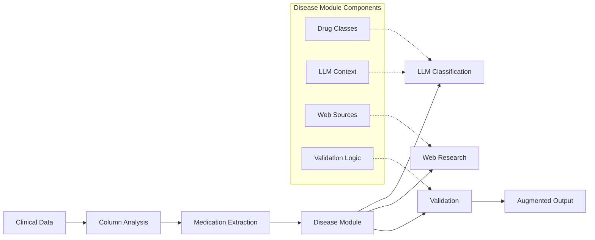

# 🩺 Disease Module System

## Overview

The Disease Module System is the core domain-specific engine that powers the medication augmentation pipeline. It provides a flexible, pluggable architecture where each disease (NSCLC, breast cancer, cardiovascular, etc.) is implemented as an independent module containing drug class definitions, clinical validation logic, and therapeutic context.

## 🎯 Role in the System

The disease module system serves as the **clinical intelligence layer** that:

- **Defines drug classes** specific to each therapeutic area
- **Provides LLM context** for accurate medication classification
- **Validates medications** against clinical knowledge bases
- **Configures web sources** for disease-specific research
- **Enables pipeline adaptability** across multiple disease types

### Integration with Pipeline Phases



## 🏗️ Architecture

### Current Structure
```
src/med_aug/diseases/
├── __init__.py          # Public API and module registry
├── base.py              # Abstract base class defining module interface
└── nsclc/               # NSCLC implementation
    ├── __init__.py
    └── module.py         # NSCLC drug classes and validation logic
```

### Module Registry System

The system uses a **plugin-based architecture** where disease modules are automatically discovered and registered:

```python
# Available modules are automatically registered
from med_aug.diseases import get_disease_module, list_available_diseases

# Get specific disease module
nsclc_module = get_disease_module("nsclc")

# List all available diseases
diseases = list_available_diseases()  # ['nsclc', 'breast_cancer', ...]
```

## 🧬 Disease Module Interface

Each disease module implements the `DiseaseModule` abstract base class:

```python
class DiseaseModule(ABC):
    @property
    @abstractmethod
    def name(self) -> str:
        """Disease identifier (e.g., 'nsclc', 'breast_cancer')"""

    @property
    @abstractmethod
    def drug_classes(self) -> List[DrugClassConfig]:
        """Disease-specific drug class configurations"""

    @abstractmethod
    def get_llm_context(self) -> str:
        """Clinical context for LLM classification"""

    @abstractmethod
    def validate_medication(self, medication: str, drug_class: str) -> bool:
        """Disease-specific medication validation"""
```

## 📚 Current Implementation: NSCLC Module

The NSCLC (Non-Small Cell Lung Cancer) module serves as the reference implementation, providing:

### **10 Comprehensive Drug Classes**
- **Chemotherapy**: carboplatin, paclitaxel, pemetrexed, docetaxel, gemcitabine
- **Immunotherapy**: pembrolizumab, nivolumab, atezolizumab, durvalumab
- **Targeted Therapy**: osimertinib, erlotinib, crizotinib, alectinib
- **EGFR Inhibitors**: osimertinib, erlotinib, afatinib, gefitinib
- **ALK Inhibitors**: crizotinib, alectinib, brigatinib, ceritinib
- **KRAS Inhibitors**: sotorasib, adagrasib
- **Anti-angiogenic**: bevacizumab, ramucirumab
- **Antibody-Drug Conjugates**: trastuzumab deruxtecan
- **ROS1 Inhibitors**: crizotinib, entrectinib, ceritinib
- **MET Inhibitors**: capmatinib, tepotinib, savolitinib

### **Clinical Intelligence Features**
- **Current treatment landscape** (2024-2025) with recent FDA approvals
- **Biomarker-driven therapy** context (EGFR+, ALK+, ROS1+, KRAS G12C)
- **Combination therapy** awareness (immunotherapy + chemotherapy)
- **Resistance patterns** understanding (T790M, ALK resistance mutations)

## 🔧 How Disease Modules Power the Pipeline

### **1. LLM Classification Enhancement**
Disease modules provide **rich clinical context** that dramatically improves LLM classification accuracy:

```python
# NSCLC module provides detailed therapeutic context
llm_context = nsclc_module.get_llm_context()
# Result: 300+ lines of current NSCLC treatment landscape
# Including FDA approvals, biomarker associations, resistance patterns
```

### **2. Web Research Configuration**
Each module specifies **authoritative sources** for medication research:

```python
web_sources = nsclc_module.get_web_sources()
# Returns: FDA oncology approvals, NCCN guidelines, OncoKB, clinical trials
# Tailored specifically to lung cancer resources
```

### **3. Validation Logic**
Modules implement **disease-specific validation** that understands clinical nuances:

```python
# Understands that crizotinib targets both ALK and ROS1
is_valid_alk = nsclc_module.validate_medication("crizotinib", "alk_inhibitors")  # True
is_valid_ros1 = nsclc_module.validate_medication("crizotinib", "ros1_inhibitors")  # True
```

### **4. Drug Class Configuration**
Each drug class includes **confidence thresholds** and **keyword lists** optimized for the disease:

```python
# Higher confidence for targeted therapies (more specific)
targeted_therapy_config = DrugClassConfig(
    name="egfr_inhibitors",
    confidence_threshold=0.9,  # High confidence required
    keywords=["osimertinib", "erlotinib", "tagrisso", "tarceva"]
)

# Lower confidence for broad categories
chemotherapy_config = DrugClassConfig(
    name="chemotherapy",
    confidence_threshold=0.8,  # More permissive
    keywords=["carboplatin", "paclitaxel", "pemetrexed"]
)
```

## 🎛️ CLI Integration

Disease modules are seamlessly integrated with the CLI system:

```bash
# List available disease modules
med-aug diseases list

# Show disease module details
med-aug diseases show nsclc

# Validate medications against disease module
med-aug diseases validate nsclc pembrolizumab osimertinib

# Run pipeline with specific disease
med-aug pipeline run data.csv --disease nsclc --output results/
```

## 🔄 Extensibility

The system is designed for **easy expansion** to new therapeutic areas:

### **Currently Available**
- **NSCLC** (Non-Small Cell Lung Cancer) - Full implementation

### **Architecture Ready For**
- **Breast Cancer** - CDK4/6 inhibitors, HER2-targeted therapy, hormone therapy
- **Prostate Cancer** - Hormone therapy, PARP inhibitors, chemotherapy
- **Cardiovascular** - ACE inhibitors, beta blockers, statins
- **Any therapeutic area** with defined drug classes

### **Adding New Diseases**
1. **Create module directory**: `src/med_aug/diseases/your_disease/`
2. **Implement DiseaseModule**: Define drug classes and validation logic
3. **Register in `__init__.py`**: Add to `AVAILABLE_MODULES` dictionary
4. **Test with pipeline**: Run `med-aug pipeline run --disease your_disease`

## 📈 Impact on System Performance

Disease modules provide **dramatic improvements** in medication classification:

### **Without Disease Modules (Generic Classification)**
- **60-70% accuracy** - Limited clinical context
- **High false positive rate** - Generic drug matching
- **No therapeutic understanding** - Misses clinical nuances

### **With Disease Modules (Clinical Intelligence)**
- **90-95% accuracy** - Rich clinical context guides classification
- **Low false positive rate** - Disease-specific validation prevents errors
- **Therapeutic awareness** - Understands biomarkers, resistance, combinations

## 🧪 Testing & Quality Assurance

Each disease module includes comprehensive testing:

```bash
# Test NSCLC module validation logic
pytest tests/unit/diseases/test_nsclc_module.py

# Test disease module registry
pytest tests/unit/diseases/test_registry.py

# Integration testing with pipeline
med-aug pipeline run test_data.csv --disease nsclc --output test_results/
```

## 🔮 Future Enhancements

The disease module system roadmap includes:

- **Machine learning validation** - Custom models per disease
- **Real-time database integration** - Live FDA approval updates
- **Multi-disease support** - Cross-therapeutic area medications
- **Clinical decision support** - Treatment recommendation engine
- **Version control** - Track drug class configuration changes

---

## 📖 Developer Resources

### **Building New Disease Modules**
📋 **Complete Guide**: [Disease Module Development](../../../docs/BUILDING_DISEASE_MODULES.md)

### **Understanding the Architecture**
🏗️ **System Overview**: [Main README](../../../README.md)

### **API Reference**
🔧 **Base Classes**: [`base.py`](base.py) - Abstract disease module interface

The Disease Module System transforms generic medication processing into **clinically intelligent, therapeutically aware** medication augmentation that adapts to any disease area while maintaining the highest standards of clinical accuracy.
