# Evaluation Module - Comprehensive Augmentation Quality Assessment

**Version:** 1.0
**Purpose:** Critical quality assurance system that validates medication classification accuracy and prevents false positives in conmeds.yml augmentation

---

## 🎯 Overview

The evaluation module is the **quality gateway** for the entire medication augmentation system. It ensures that every addition to `conmeds.yml` files is clinically accurate, properly classified, and backed by quantitative metrics. This prevents degradation of downstream clinical pipelines and maintains the integrity of medication matching systems.

### **Why This Module is Extremely Important**

1. **Patient Safety**: Incorrect medication classifications can impact clinical research and patient care
2. **Research Quality**: False positives in medication databases corrupt clinical trial analyses
3. **System Trust**: Quantitative evaluation builds confidence in automated augmentation
4. **Continuous Improvement**: Metrics-driven feedback loop improves classification accuracy over time
5. **Regulatory Compliance**: Auditable evaluation trails support FDA and clinical regulatory requirements

---

## 🏗️ Architecture

### **Core Components**

```
evaluation/
├── __init__.py             # Module exports
├── README.md              # This comprehensive documentation
├── metrics.py             # Classification metrics (precision, recall, F1)
├── evaluator.py           # Main evaluation engine
├── llm_evaluator.py       # LLM-assisted validation
├── ground_truth.py        # Ground truth dataset management
└── data/
    └── nsclc_ground_truth_sample.json
```

### **Evaluation Flow**

```mermaid
%%{init: {
  'theme': 'dark',
  'themeVariables': {
    'darkMode': true,
    'background': '#0d1117',
    'primaryColor': '#58a6ff',
    'primaryTextColor': '#f0f6fc',
    'lineColor': '#58a6ff'
  }
}}%%
flowchart TD
    A[📊 Classification Results] --> B[🔍 Load Ground Truth]
    B --> C[📈 Calculate Metrics]
    C --> D[❌ Identify Errors]
    D --> E{High Error Rate?}

    E -->|Yes| F[🤖 LLM Validation]
    E -->|No| G[✅ Accept Results]

    F --> H[🧠 Clinical Assessment]
    H --> I{LLM Says Valid?}

    I -->|Yes| J[➕ Add to Ground Truth]
    I -->|No| K[🚫 Flag as False Positive]

    J --> L[📋 Generate Report]
    K --> L
    G --> L

    L --> M[💾 Save Evaluation Data]

    classDef inputNode fill:#0969da,stroke:#1f6feb,stroke-width:2px,color:#ffffff
    classDef processNode fill:#238636,stroke:#2ea043,stroke-width:2px,color:#ffffff
    classDef decisionNode fill:#9a6700,stroke:#bf8700,stroke-width:2px,color:#ffffff
    classDef llmNode fill:#6f42c1,stroke:#8b5cf6,stroke-width:2px,color:#ffffff
    classDef outputNode fill:#0969da,stroke:#1f6feb,stroke-width:3px,color:#ffffff

    class A inputNode
    class B,C,D,H,M processNode
    class E,I decisionNode
    class F,J,K llmNode
    class G,L outputNode
```



---

## 📊 Metrics Framework

### **1. Classification Metrics (`metrics.py`)**

#### **Per-Class Metrics**
```python
@dataclass
class ClassificationMetrics:
    drug_class: str
    true_positives: int = 0      # Correctly classified medications
    false_positives: int = 0     # Incorrectly classified as this class
    false_negatives: int = 0     # Should be this class but missed

    @property
    def precision(self) -> float:
        """TP / (TP + FP) - How many predictions are correct"""
        return self.true_positives / (self.true_positives + self.false_positives)

    @property
    def recall(self) -> float:
        """TP / (TP + FN) - How many actual cases we found"""
        return self.true_positives / (self.true_positives + self.false_negatives)

    @property
    def f1_score(self) -> float:
        """2 * (precision * recall) / (precision + recall)"""
        return 2 * (self.precision * self.recall) / (self.precision + self.recall)
```

#### **Overall System Metrics**
```python
@dataclass
class EvaluationMetrics:
    # Macro-averaged: Simple average across all classes
    macro_precision: float    # Average precision per class
    macro_recall: float       # Average recall per class
    macro_f1: float          # Average F1 per class

    # Weighted: Weighted by class frequency (ground truth support)
    weighted_precision: float # Precision weighted by class size
    weighted_recall: float    # Recall weighted by class size
    weighted_f1: float       # F1 weighted by class size

    # System-wide metrics
    overall_accuracy: float          # Total correct / total medications
    classification_coverage: float   # Classified / total medications
```

### **2. Key Metrics Explained**

| Metric | Formula | Interpretation | Target Value |
|--------|---------|----------------|--------------|
| **Precision** | TP/(TP+FP) | Of predicted positives, how many are correct? | >0.90 |
| **Recall** | TP/(TP+FN) | Of actual positives, how many did we find? | >0.85 |
| **F1 Score** | 2×(P×R)/(P+R) | Harmonic mean balancing precision/recall | >0.87 |
| **Coverage** | Classified/Total | What percentage of medications got classified? | >0.95 |
| **Accuracy** | Correct/Total | Overall system correctness | >0.90 |

---

## 🔍 Ground Truth Management

### **Ground Truth Sources (`ground_truth.py`)**

#### **1. Existing conmeds.yml as Baseline**
```python
def create_from_existing_conmeds(self, conmeds_file: Path) -> GroundTruthDataset:
    """
    Creates ground truth from manually curated conmeds_defaults.yml.

    This gives us:
    - 57 NSCLC drug classes
    - ~147 medications with expert validation
    - High confidence baseline (confidence=1.0)
    """
```

#### **2. Expert-Validated Classifications**
```python
def create_from_expert_validation(
    self,
    medications: List[str],
    expert_classifications: Dict[str, str],
    expert_name: str = "clinical_expert"
) -> GroundTruthDataset:
    """
    Creates ground truth from clinical expert review.

    Used for:
    - Validating ambiguous medications
    - Creating disease-specific ground truth
    - Building confidence in new drug classes
    """
```

#### **3. LLM-Assisted Ground Truth Expansion**
```python
async def suggest_ground_truth_updates(
    self,
    llm_evaluations: List[LLMEvaluationResult],
    min_confidence: float = 0.8
) -> List[GroundTruthEntry]:
    """
    Expands ground truth with high-confidence LLM validations.

    Criteria:
    - LLM assessment: "correct"
    - LLM confidence: ≥0.8
    - Clinical reasoning provided
    """
```

---

## 🤖 LLM-Assisted Validation

### **Why LLM Validation is Critical**

Traditional rule-based evaluation can't handle:
- **Novel medications** not in ground truth
- **Ambiguous classifications** across multiple classes
- **Emerging therapies** with new mechanisms of action
- **Research nomenclature** vs. approved drug names

### **LLM Evaluation Process (`llm_evaluator.py`)**

#### **1. Single Medication Assessment**
```python
async def _evaluate_single_classification(
    self,
    medication: str,
    predicted_class: str,
    drug_classes_info: str
) -> LLMEvaluationResult:
    """
    Uses clinical expertise prompts to assess:
    1. Mechanism of action alignment
    2. FDA approval status for NSCLC
    3. Clinical guideline recommendations
    4. Drug naming conventions
    5. Treatment protocol standards
    """
```

#### **2. False Positive Validation**
```python
async def evaluate_false_positives(
    self,
    false_positives: Dict[str, List[str]],
    max_per_class: int = 5
) -> Dict[str, List[LLMEvaluationResult]]:
    """
    Critical function that prevents corruption of ground truth.

    For each "false positive":
    - Validates if it's actually a correct new discovery
    - Provides clinical reasoning
    - Suggests alternative classifications
    - Identifies clear errors vs. ambiguous cases
    """
```

#### **3. Clinical Assessment Framework**

```python
evaluation_prompt_template = """
You are a clinical pharmacist and medication expert. Evaluate this classification:

**Medication:** {medication}
**Predicted Class:** {predicted_class}

Respond with JSON:
{
  "assessment": "correct|incorrect|ambiguous|unknown",
  "confidence": 0.95,
  "reasoning": "Detailed clinical explanation",
  "alternative_classes": ["alt1", "alt2"],
  "clinical_notes": "Additional context"
}

Consider:
1. Mechanism of action
2. FDA approvals for NSCLC
3. Clinical guidelines (NCCN, ASCO)
4. Standard treatment protocols
5. Drug naming patterns
"""
```

---

## 🔄 Evaluation Workflow

### **Step-by-Step Process**

#### **1. Load Classification Results**
```python
# Input: Predictions from LLM classification phase
predictions = {
    "keytruda": "taking_pembrolizumab",        # Known medication
    "azd9291": "taking_osimertinib",           # Research code → approved name
    "selpercatinib": "taking_selpercatinib",   # New drug class needed
    "co-1686": "taking_rociletinib",           # Development compound
}

confidence_scores = {
    "keytruda": 0.98,      # High confidence
    "azd9291": 0.94,       # High confidence
    "selpercatinib": 0.85, # Medium confidence
    "co-1686": 0.72,       # Lower confidence
}
```

#### **2. Calculate Baseline Metrics**
```python
evaluator = MedicationEvaluator()
report = evaluator.evaluate_classification_results(
    predictions=predictions,
    confidence_scores=confidence_scores,
    minimum_confidence=0.7
)

print(f"Weighted F1: {report.metrics.weighted_f1:.3f}")
print(f"Coverage: {report.metrics.classification_coverage:.3f}")
print(f"False Positives: {len(report.false_positives)} classes affected")
```

#### **3. LLM Validation of Errors**
```python
llm_evaluator = LLMAssistedEvaluator()

# Focus on false positives (most critical to validate)
fp_evaluations = await llm_evaluator.evaluate_false_positives(
    report.false_positives,
    max_per_class=5
)

# Example result:
{
    "taking_selpercatinib": [
        LLMEvaluationResult(
            medication="selpercatinib",
            predicted_class="taking_selpercatinib",
            llm_assessment="correct",
            confidence=0.92,
            reasoning="Selpercatinib is FDA-approved RET inhibitor for RET+ NSCLC (2020)",
            clinical_notes="Valid new drug class for targeted therapy"
        )
    ]
}
```

#### **4. Ground Truth Updates**
```python
# Identify high-confidence LLM validations for ground truth expansion
ground_truth_updates = await llm_evaluator.suggest_ground_truth_updates(
    llm_evaluations=all_llm_results,
    min_confidence=0.85
)

# Add validated entries to ground truth
for update in ground_truth_updates:
    ground_truth_manager.add_validated_entry(update)
```

#### **5. Generate Final Report**
```python
evaluation_summary = {
    "overall_metrics": {
        "weighted_f1": 0.94,
        "precision": 0.96,
        "recall": 0.92,
        "coverage": 0.97
    },
    "quality_assessment": {
        "total_classifications": 152,
        "new_discoveries_validated": 5,
        "false_positives_prevented": 0,
        "ground_truth_expansions": 2
    },
    "clinical_validation": {
        "llm_evaluations_performed": 8,
        "high_confidence_validations": 6,
        "clinical_expert_review_needed": 2
    }
}
```

---

## 📋 Detailed Report Structure

### **Classification Report Components**

#### **1. Overall Metrics Summary**
```json
{
  "overall_metrics": {
    "macro_f1": 0.891,
    "weighted_f1": 0.943,
    "precision": 0.956,
    "recall": 0.924,
    "coverage": 0.973,
    "total_medications": 152,
    "total_classified": 148,
    "drug_classes_evaluated": 59
  }
}
```

#### **2. Per-Class Performance**
```json
{
  "class_metrics": {
    "taking_pembrolizumab": {
      "precision": 1.000,
      "recall": 0.950,
      "f1_score": 0.974,
      "support": 8,
      "true_positives": 8,
      "false_positives": 0,
      "false_negatives": 1
    },
    "taking_osimertinib": {
      "precision": 0.857,
      "recall": 1.000,
      "f1_score": 0.923,
      "support": 6,
      "true_positives": 6,
      "false_positives": 1,
      "false_negatives": 0
    }
  }
}
```

#### **3. Detailed Error Analysis**
```json
{
  "detailed_errors": {
    "false_positives": {
      "taking_osimertinib": ["azd3759"],  # Development code for osimertinib
      "taking_rociletinib": ["co-1686"]   # Research compound name
    },
    "false_negatives": {
      "taking_pembrolizumab": ["keytruda_biosimilar"]  # Missed variant
    },
    "misclassifications": [
      {
        "medication": "mobocertinib",
        "predicted": "taking_gefitinib",
        "actual": "taking_mobocertinib"  # New class needed
      }
    ]
  }
}
```

#### **4. LLM Validation Results**
```json
{
  "llm_validation": {
    "total_evaluated": 5,
    "assessment_distribution": {
      "correct": 3,    # 60% - Actually valid new discoveries
      "incorrect": 1,  # 20% - True false positives
      "ambiguous": 1,  # 20% - Needs expert review
      "unknown": 0     # 0%  - Insufficient information
    },
    "average_confidence": 0.89,
    "potential_ground_truth_additions": 3,
    "clear_errors_found": 1
  }
}
```

#### **5. Actionable Insights**
```json
{
  "actionable_insights": {
    "high_priority_fixes": [
      "taking_egfr_inhibitors: F1=0.654, Support=15 - Needs attention"
    ],
    "false_positive_patterns": [
      "'azd-compounds' incorrectly classified 3 times - review naming patterns"
    ],
    "coverage_improvements": [
      "5 medications remain unclassified",
      "Top unclassified: experimental_compound_1, trial_drug_x"
    ],
    "ground_truth_expansion_opportunities": [
      "selpercatinib validated as new RET inhibitor class",
      "mobocertinib validated as new EGFR exon 20 class"
    ]
  }
}
```

---

## 🎯 Quality Thresholds & Decision Rules

### **Acceptance Criteria**

| Metric | Minimum | Target | Action if Below |
|--------|---------|---------|-----------------|
| **Weighted F1** | 0.85 | 0.90 | Review classification rules |
| **Precision** | 0.90 | 0.95 | LLM validation of false positives |
| **Recall** | 0.80 | 0.87 | Expand ground truth coverage |
| **Coverage** | 0.90 | 0.95 | Improve unclassified handling |
| **LLM Validation Rate** | 80% | 90% | Expert clinical review needed |

### **Decision Framework**

```python
def make_augmentation_decision(evaluation_report: ClassificationReport) -> str:
    """
    Decision logic for accepting/rejecting augmentation results.

    Returns: "accept", "review_needed", or "reject"
    """
    metrics = evaluation_report.metrics

    # High quality - auto accept
    if (metrics.weighted_f1 >= 0.90 and
        metrics.weighted_precision >= 0.95 and
        metrics.classification_coverage >= 0.95):
        return "accept"

    # Low quality - reject
    if (metrics.weighted_f1 < 0.85 or
        metrics.weighted_precision < 0.90):
        return "reject"

    # Medium quality - needs review
    return "review_needed"
```

---

## 🚀 Usage Examples

### **Basic Evaluation**
```python
from src.med_aug.evaluation import MedicationEvaluator

# Initialize evaluator with ground truth
evaluator = MedicationEvaluator()

# Evaluate classification results
predictions = {"keytruda": "taking_pembrolizumab", "azd9291": "taking_osimertinib"}
confidence_scores = {"keytruda": 0.98, "azd9291": 0.94}

report = evaluator.evaluate_classification_results(
    predictions=predictions,
    confidence_scores=confidence_scores,
    minimum_confidence=0.7
)

# Print summary
report.print_summary()

# Save detailed report
report.save_report("evaluation_report.json")
```

### **LLM-Assisted Validation**
```python
from src.med_aug.evaluation import LLMAssistedEvaluator

# Initialize LLM evaluator
llm_evaluator = LLMAssistedEvaluator()

# Validate false positives
fp_results = await llm_evaluator.evaluate_false_positives(
    report.false_positives,
    max_per_class=5
)

# Generate ground truth suggestions
ground_truth_updates = await llm_evaluator.suggest_ground_truth_updates(
    llm_evaluations=fp_results,
    min_confidence=0.8
)

print(f"Suggested {len(ground_truth_updates)} ground truth additions")
```

### **Before/After Comparison**
```python
# Compare classification improvements
comparison = evaluator.compare_before_after(
    before_predictions=original_classifications,
    after_predictions=augmented_classifications,
    confidence_scores=confidence_scores
)

print(f"F1 Improvement: {comparison['improvements']['f1_change']:.3f}")
print(f"New Classifications: {comparison['new_classifications']['count']}")
```

### **Ground Truth Management**
```python
from src.med_aug.evaluation import GroundTruthManager

# Initialize ground truth manager
gt_manager = GroundTruthManager()

# Create ground truth from existing conmeds
dataset = gt_manager.create_from_existing_conmeds(
    Path("data/conmeds_defaults.yml")
)

# Add expert validations
expert_validations = {
    "selpercatinib": "taking_selpercatinib",
    "mobocertinib": "taking_mobocertinib"
}

expert_dataset = gt_manager.create_from_expert_validation(
    medications=["selpercatinib", "mobocertinib"],
    expert_classifications=expert_validations,
    expert_name="dr_oncologist"
)

# Merge datasets
merged = gt_manager.merge_datasets("default", "expert_validated")

# Get statistics
stats = gt_manager.get_statistics("merged")
print(f"Total medications: {stats['total_medications']}")
print(f"Drug classes: {stats['total_drug_classes']}")
```

---

## 🔧 Integration with Pipeline

### **Pipeline Integration Points**

#### **1. During Classification Phase**
```python
# After LLM classification, automatically evaluate
if config.enable_evaluation:
    evaluator = MedicationEvaluator()
    evaluation_report = evaluator.evaluate_classification_results(
        predictions=classification_results,
        confidence_scores=llm_confidence_scores
    )

    # Store evaluation results for final report
    pipeline_state.evaluation_report = evaluation_report
```

#### **2. Pre-Augmentation Quality Gate**
```python
# Before augmenting conmeds.yml, check quality
decision = make_augmentation_decision(evaluation_report)

if decision == "reject":
    logger.error("Evaluation failed - augmentation rejected")
    raise PipelineQualityError("Insufficient classification quality")

elif decision == "review_needed":
    logger.warning("Manual review required before augmentation")
    # Continue but flag for review
```

#### **3. LLM Validation of Ambiguous Cases**
```python
# For ambiguous classifications, use LLM validation
if evaluation_report.metrics.weighted_f1 < 0.90:
    llm_evaluator = LLMAssistedEvaluator()

    llm_results = await llm_evaluator.evaluate_false_positives(
        evaluation_report.false_positives
    )

    # Update classifications based on LLM validation
    validated_additions = filter_validated_additions(llm_results)
    final_classifications.update(validated_additions)
```

### **CLI Integration**

```bash
# Activate virtual environment
source .venv/bin/activate

# Run pipeline with comprehensive evaluation
med-aug pipeline run clinical_data.csv \
  --conmeds data/conmeds_defaults.yml \
  --disease nsclc \
  --evaluate \
  --confidence 0.8 \
  --output ./results

# Evaluation outputs generated:
# - evaluation_report.json (detailed metrics)
# - llm_validation_results.json (LLM assessments)
# - ground_truth_updates.json (suggested additions)
```

---

## ⚠️ Critical Considerations

### **1. Clinical Accuracy is Paramount**
- Every classification affects patient care research
- False positives can corrupt clinical trial analyses
- Conservative approach: "When in doubt, validate with experts"

### **2. Ground Truth Quality**
- Ground truth is only as good as source data
- Regular expert review and validation essential
- LLM validation supplements but doesn't replace human expertise

### **3. Confidence Calibration**
- Confidence scores must be well-calibrated
- Regular validation against expert assessments
- Threshold tuning based on clinical risk tolerance

### **4. Transparency & Auditability**
- All evaluation decisions must be traceable
- LLM reasoning preserved for clinical review
- Metrics trends tracked over time

### **5. Disease-Specific Contexts**
- Drug classifications vary by therapeutic area
- NSCLC-focused now, but architecture supports other diseases
- Evaluation criteria may need disease-specific tuning

---

## 📈 Monitoring & Continuous Improvement

### **Metrics Tracking**
- Evaluation metrics trends over time
- Ground truth quality indicators
- LLM validation accuracy vs. expert review
- False positive/negative pattern analysis

### **Feedback Loops**
1. **Expert Review** → Ground Truth Updates
2. **LLM Validation** → Classification Rule Improvements
3. **Metrics Analysis** → Threshold Optimization
4. **Error Patterns** → Training Data Enhancement

### **Quality Assurance Process**
1. **Automated Evaluation** (this module)
2. **LLM Validation** (high-confidence filtering)
3. **Expert Review** (final validation for ambiguous cases)
4. **Clinical Testing** (real-world validation)
5. **Feedback Integration** (continuous improvement)

---

## 🎖️ Success Metrics

The evaluation module is successful when:

- **Classification Quality**: Weighted F1 > 0.90 consistently
- **False Positive Prevention**: <5% of augmentations are clinically incorrect
- **Ground Truth Expansion**: Validated new drug classes added quarterly
- **Expert Confidence**: Clinical teams trust automated augmentations
- **System Reliability**: Evaluation catches quality issues before deployment

This evaluation framework ensures that medication augmentation maintains the highest standards of clinical accuracy while enabling automated discovery of legitimate new medications and drug classes.
