# Pipeline Module

## Overview

The pipeline module orchestrates medication augmentation processes for any disease indication to expand conmeds.yml files. It provides robust, disease-agnostic execution management with checkpointing, recovery, and progress tracking, focusing on generating production-ready YAML configuration files with comprehensive drug name coverage across therapeutic areas.

## Pipeline Architecture

### High-Level Flow
```
Clinical Data → Analysis → Extraction → Research → Classification → Evaluation → Augmented conmeds.yml
```

### Detailed Pipeline Flow

```mermaid
%%{init: {
  'theme': 'dark',
  'themeVariables': {
    'darkMode': true,
    'background': '#0d1117',
    'primaryColor': '#58a6ff',
    'primaryTextColor': '#f0f6fc',
    'primaryBorderColor': '#30363d',
    'lineColor': '#58a6ff',
    'secondaryColor': '#21262d',
    'tertiaryColor': '#30363d',
    'clusterBkg': '#161b22',
    'clusterBorder': '#30363d',
    'edgeLabelBackground': '#21262d'
  },
  'flowchart': {
    'nodeSpacing': 50,
    'rankSpacing': 60,
    'curve': 'basis'
  }
}}%%
flowchart TD
    %% Input and Start
    A["📊 Clinical Dataset<br/><small>CSV/Excel/Parquet</small>"] 
    
    %% Phase 1: Data Ingestion
    A -->|"Load Data"| B["🔄 Data Ingestion Phase"]
    B -->|"Validate"| B1{File Valid?}
    B1 -->|"✅ Valid"| C["🔍 Column Analysis Phase"]
    B1 -->|"❌ Invalid"| ERROR1["💥 Error: Invalid File"]
    
    %% Phase 2: Column Analysis  
    C -->|"Analyze"| C1["🎯 Find Medication Columns"]
    C1 -->|"Check Results"| C2{Medication Data<br/>Found?}
    C2 -->|"✅ Found"| D["💊 Medication Extraction Phase"]
    C2 -->|"❌ None Found"| ERROR2["💥 Error: No Medication Data"]
    
    %% Phase 3: Medication Extraction
    D -->|"Extract Names"| D1["🧹 Clean & Normalize<br/>Medication Names"]
    D1 -->|"Process"| D2["📋 Deduplicate Results"]
    
    %% Optional: Web Research
    D2 -->|"Check Config"| E{Web Research<br/>Enabled?}
    E -->|"✅ Yes"| F["🌐 Web Research Phase"]
    E -->|"❌ No"| G["🤖 LLM Classification Phase"]
    
    F -->|"Search"| F1["📚 FDA Database"]
    F -->|"Search"| F2["🏥 Clinical Guidelines"] 
    F -->|"Search"| F3["💊 Drug Databases"]
    F1 & F2 & F3 -->|"Merge Results"| G
    
    %% Phase 4: LLM Classification
    G -->|"Load References"| G1["📋 Load conmeds_defaults.yml<br/>& Disease Module"]
    G1 -->|"Classify"| G2["🧠 Claude LLM Classification<br/>vs Ground Truth"]
    G2 -->|"Check Config"| G3{Evaluation<br/>Enabled?}
    
    %% Phase 5: Evaluation (Optional but Recommended)
    G3 -->|"✅ Yes"| H["📊 Evaluation Phase"]
    G3 -->|"❌ No"| K["📤 Output Generation Phase"]
    
    H -->|"Compare"| H1["🔍 Compare vs Ground Truth"]
    H1 -->|"Analyze"| H2["⚠️ Identify False Positives<br/>& False Negatives"]
    H2 -->|"Validate"| H3["🤖 LLM Validation of<br/>New Discoveries"]
    H3 -->|"Report"| H4["📈 Generate Quality Metrics<br/>& Recommendations"]
    H4 -->|"Continue"| K
    
    %% Phase 6: Output Generation
    K -->|"Generate"| K1["📄 Create conmeds_augmented.yml"]
    K1 -->|"Export"| K2["📊 Export Classification Results"]
    K2 -->|"Create"| K3["📋 Generate Evaluation Reports"]
    K3 -->|"Complete"| L["✅ Pipeline Complete"]
    
    %% Input Sources
    subgraph INPUTS ["📥 Input Sources"]
        direction TB
        IN1["📄 conmeds_defaults.yml<br/><small>Existing Ground Truth</small>"]
        IN2["⚙️ Disease Module<br/><small>Drug Class Definitions</small>"]
        IN3["📊 Clinical Dataset<br/><small>Raw Medication Records</small>"]
    end
    
    %% Output Deliverables
    subgraph OUTPUTS ["📤 Generated Outputs"]
        direction TB
        OUT1["🎯 conmeds_augmented.yml<br/><small><b>PRIMARY DELIVERABLE</b></small>"]
        OUT2["📊 evaluation_report.json<br/><small>Quality Metrics & Insights</small>"]
        OUT3["📋 classification_results.csv<br/><small>Detailed Results</small>"]
        OUT4["⏱️ pipeline_summary.json<br/><small>Execution Summary</small>"]
    end
    
    %% Connect inputs and outputs with dotted lines
    IN1 -.->|"Reference"| G1
    IN2 -.->|"Load"| G1
    IN3 -.->|"Process"| A
    
    K1 -.->|"Generate"| OUT1
    H4 -.->|"Create"| OUT2
    K2 -.->|"Export"| OUT3
    K3 -.->|"Summary"| OUT4
    
    %% Styling for dark mode compatibility
    classDef inputNode fill:#0969da,stroke:#1f6feb,stroke-width:2px,color:#ffffff
    classDef processNode fill:#238636,stroke:#2ea043,stroke-width:2px,color:#ffffff
    classDef decisionNode fill:#9a6700,stroke:#bf8700,stroke-width:2px,color:#ffffff
    classDef errorNode fill:#da3633,stroke:#f85149,stroke-width:2px,color:#ffffff
    classDef evaluationNode fill:#6f42c1,stroke:#8b5cf6,stroke-width:2px,color:#ffffff
    classDef outputNode fill:#0969da,stroke:#1f6feb,stroke-width:3px,color:#ffffff
    classDef primaryOutput fill:#238636,stroke:#2ea043,stroke-width:4px,color:#ffffff
    
    %% Apply styles
    class A,IN1,IN2,IN3 inputNode
    class B,C,D,F,G,K processNode
    class C1,D1,D2,F1,F2,F3,G1,G2,K1,K2,K3,L processNode
    class B1,C2,E,G3 decisionNode
    class ERROR1,ERROR2 errorNode
    class H,H1,H2,H3,H4 evaluationNode
    class OUT2,OUT3,OUT4 outputNode
    class OUT1 primaryOutput
```



### Key Pipeline Features
- **Checkpointing**: Resume from any phase if interrupted
- **Disease-Agnostic**: Same pipeline works for NSCLC, breast cancer, etc.
- **Quality Assurance**: LLM-assisted evaluation prevents false positives
- **Incremental Enhancement**: Builds on existing conmeds rather than replacing

## Structure

```
pipeline/
├── __init__.py
├── orchestrator.py     # Main pipeline orchestrator
├── phases.py          # Individual pipeline phases
├── checkpoint.py      # Checkpoint and recovery system
└── progress.py        # Progress tracking with Rich UI
```

## Key Components

### Pipeline Orchestrator (`orchestrator.py`)

Central coordinator for pipeline execution:

```python
from med_aug.pipeline import PipelineOrchestrator, PipelineConfig

config = PipelineConfig(
    input_file="data.csv",
    output_dir="./results",
    disease_module="nsclc",  # or "breast_cancer", "prostate_cancer", etc.
    enable_llm=True,
    enable_web_research=True,
    batch_size=100,
    checkpoint_interval=5
)

orchestrator = PipelineOrchestrator(config)

# Execute full pipeline
results = await orchestrator.run()

# Resume from checkpoint
results = await orchestrator.resume(
    pipeline_id="abc123",
    from_phase="validation"
)
```

### Pipeline Phases (`phases.py`)

Each phase implements a specific step in the process:

#### 1. Data Analysis Phase
```python
from med_aug.pipeline.phases import DataAnalysisPhase

phase = DataAnalysisPhase(config)
result = await phase.execute(dataframe)

# Result contains:
# - Identified medication columns
# - Confidence scores
# - Sample medications
# - Column statistics
```

#### 2. Extraction Phase
```python
from med_aug.pipeline.phases import ExtractionPhase

phase = ExtractionPhase(config)
result = await phase.execute(analysis_result)

# Result contains:
# - Extracted medications
# - Normalized medications
# - Frequency maps
# - Variant mappings
```

#### 3. Validation Phase
```python
from med_aug.pipeline.phases import ValidationPhase

phase = ValidationPhase(config)
result = await phase.execute(extraction_result)

# Result contains:
# - Valid medications
# - Invalid medications
# - Drug class assignments
# - Validation confidence
```

#### 4. LLM Classification Phase
```python
from med_aug.pipeline.phases import LLMClassificationPhase

phase = LLMClassificationPhase(config)
result = await phase.execute(medications)

# Result contains:
# - Classification results
# - Confidence scores
# - Drug class distribution
# - LLM reasoning
```

#### 5. Web Research Phase
```python
from med_aug.pipeline.phases import WebResearchPhase

phase = WebResearchPhase(config)
result = await phase.execute(medications)

# Result contains:
# - FDA approval data
# - Clinical trial information
# - NCCN guidelines
# - OncoKB annotations
```

#### 6. Output Generation Phase
```python
from med_aug.pipeline.phases import OutputGenerationPhase

phase = OutputGenerationPhase(config)
result = await phase.execute(all_phase_results)

# Result contains:
# - conmeds_augmented.yml (primary deliverable)
# - classification_results.json
# - pipeline_summary.json
# - Export files in various formats
```

### Pipeline Configuration

Configuration is handled through the PipelineConfig dataclass in the orchestrator:

```python
@dataclass
class PipelineConfig:
    input_file: str
    output_path: str = "./output"
    disease_module: str = "nsclc"  # Any disease: "nsclc", "breast_cancer", "prostate_cancer", etc.
    enable_llm_classification: bool = False
    llm_provider: str = "claude_cli"
    enable_web_research: bool = True
    enable_validation: bool = True
    batch_size: int = 100
    max_workers: int = 4
```

### Checkpoint System (`checkpoint.py`)

Robust checkpoint and recovery mechanism:

```python
from med_aug.pipeline import CheckpointManager

manager = CheckpointManager(
    checkpoint_dir="./checkpoints",
    max_checkpoints=10
)

# Save checkpoint
checkpoint = manager.save_checkpoint(
    pipeline_id="abc123",
    phase="extraction",
    state=phase_state,
    metadata={"progress": 0.5}
)

# Load checkpoint
state = manager.load_checkpoint("abc123")

# List checkpoints
checkpoints = manager.list_checkpoints()

# Clean old checkpoints
manager.clean_old_checkpoints(days=7)
```

## Pipeline Execution

### Sequential Execution
```python
# Phases execute in order
orchestrator = PipelineOrchestrator(config)
results = await orchestrator.run()

# Execution order:
# 1. Data Analysis
# 2. Extraction
# 3. Validation
# 4. LLM Classification (if enabled)
# 5. Web Research (if enabled)
# 6. Output Generation
```

### Parallel Phase Execution
```python
# Some phases can run in parallel
config = PipelineConfig(
    parallel_phases=["llm_classification", "web_research"],
    max_workers=4
)

orchestrator = PipelineOrchestrator(config)
# LLM and Web Research run simultaneously
results = await orchestrator.run()
```

### Custom Phase Selection
```python
# Run specific phases only
orchestrator = PipelineOrchestrator(config)

results = await orchestrator.run_phases([
    "analysis",
    "extraction",
    "output"
])
```

## Progress Tracking

### Rich Console Display
```python
from med_aug.pipeline import PipelineProgress

progress = PipelineProgress()

# Automatic progress display
with progress:
    results = await orchestrator.run()

# Output:
# ┌─────────────────────────────────┐
# │ Pipeline Progress               │
# ├─────────────────────────────────┤
# │ ▶ Analysis       [####    ] 50% │
# │ ⏸ Extraction                    │
# │ ⏸ Validation                    │
# │ ⏸ Classification                │
# └─────────────────────────────────┘
```

### Programmatic Progress
```python
# Subscribe to progress events
def on_progress(phase: str, progress: float, message: str):
    print(f"{phase}: {progress:.0%} - {message}")

orchestrator.on_progress = on_progress
results = await orchestrator.run()
```

## Error Handling and Recovery

### Automatic Retry
```python
config = PipelineConfig(
    retry_failed_phases=True,
    max_retries=3,
    retry_delay=5.0
)

orchestrator = PipelineOrchestrator(config)
results = await orchestrator.run()
```

### Error Recovery
```python
try:
    results = await orchestrator.run()
except PipelineError as e:
    # Recover from last checkpoint
    checkpoint = orchestrator.get_last_checkpoint()
    results = await orchestrator.resume(
        pipeline_id=checkpoint.id,
        from_phase=checkpoint.phase
    )
```

### Graceful Degradation
```python
# Continue on phase failure
config = PipelineConfig(
    continue_on_error=True,
    skip_failed_phases=True
)

orchestrator = PipelineOrchestrator(config)
results = await orchestrator.run()

# Check which phases succeeded
for phase, result in results.items():
    if result.success:
        print(f"{phase}: Success")
    else:
        print(f"{phase}: Failed - {result.error}")
```

## CLI Integration

```bash
# Run full pipeline for any disease
med-aug pipeline run data.csv \
  --disease nsclc \
  --llm \
  --output results/

# Run for different diseases
med-aug pipeline run data.csv \
  --disease breast_cancer \
  --llm \
  --output results/

# Run without LLM (faster, rule-based)
med-aug pipeline run data.csv \
  --disease nsclc \
  --no-llm

# Resume from checkpoint
med-aug pipeline resume \
  --id abc123 \
  --from validation

# Check pipeline status
med-aug pipeline status abc123

# List checkpoints
med-aug pipeline list

# Clean old checkpoints
med-aug pipeline clean --days 7

# Analyze file only
med-aug pipeline analyze data.csv

# Extract medications only
med-aug pipeline extract data.csv medications_column
```

## Phase Dependencies

### Dependency Graph
```python
PHASE_DEPENDENCIES = {
    "analysis": [],
    "extraction": ["analysis"],
    "validation": ["extraction"],
    "llm_classification": ["extraction"],
    "web_research": ["extraction"],
    "output": ["extraction", "validation"]
}
```

### Dynamic Dependencies
```python
# Configure phase dependencies
config = PipelineConfig(
    phase_dependencies={
        "custom_phase": ["extraction", "validation"],
        "output": ["all"]  # Depends on all phases
    }
)
```

## Custom Phases

### Creating a Custom Phase
```python
from med_aug.pipeline import BasePhase, PhaseResult

class CustomPhase(BasePhase):
    def __init__(self, config: PipelineConfig):
        super().__init__("custom", config)

    async def execute(self, input_data: Any) -> PhaseResult:
        try:
            # Phase implementation
            result = await self.process_data(input_data)

            return PhaseResult(
                phase_name="custom",
                success=True,
                data=result,
                metrics={"processed": len(result)},
                execution_time=self.elapsed_time
            )
        except Exception as e:
            return self.create_error_result(e)
```

### Registering Custom Phase
```python
from med_aug.pipeline import PhaseRegistry

registry = PhaseRegistry.get_instance()
registry.register_phase("custom", CustomPhase)

# Use in pipeline
config = PipelineConfig(
    custom_phases=["custom"],
    phase_order=["analysis", "custom", "output"]
)
```

## Performance Optimization

### Batch Processing
```python
# Process data in batches
config = PipelineConfig(
    batch_size=500,
    batch_timeout=30
)

# Phases automatically batch process
orchestrator = PipelineOrchestrator(config)
results = await orchestrator.run()
```

### Memory Management
```python
# Stream large files
config = PipelineConfig(
    stream_mode=True,
    chunk_size=10000,
    max_memory_mb=1024
)

orchestrator = PipelineOrchestrator(config)
results = await orchestrator.run_streaming()
```

### Caching
```python
# Enable phase result caching
config = PipelineConfig(
    enable_caching=True,
    cache_dir="./phase_cache",
    cache_ttl=3600
)

# Phases reuse cached results when available
orchestrator = PipelineOrchestrator(config)
results = await orchestrator.run()
```

## Monitoring and Logging

### Pipeline Metrics
```python
from med_aug.pipeline import PipelineMetrics

metrics = orchestrator.get_metrics()

print(f"Total execution time: {metrics.total_time:.2f}s")
print(f"Phase times: {metrics.phase_times}")
print(f"Memory usage: {metrics.peak_memory_mb:.0f} MB")
print(f"Rows processed: {metrics.rows_processed}")
print(f"Success rate: {metrics.success_rate:.2%}")
```

### Detailed Logging
```python
import logging

# Enable debug logging
logging.basicConfig(level=logging.DEBUG)

orchestrator = PipelineOrchestrator(config)
# Detailed logs for each phase
results = await orchestrator.run()
```

### Audit Trail
```python
# Track all pipeline operations
audit = orchestrator.get_audit_trail()

for event in audit:
    print(f"{event.timestamp}: {event.phase} - {event.action}")
```

## Testing

### Unit Testing Phases
```python
import pytest

@pytest.mark.asyncio
async def test_extraction_phase():
    config = PipelineConfig(input_file="test.csv")
    phase = ExtractionPhase(config)

    test_data = create_test_data()
    result = await phase.execute(test_data)

    assert result.success
    assert len(result.data.medications) > 0
```

### Integration Testing
```python
@pytest.mark.integration
async def test_full_pipeline():
    config = PipelineConfig(
        input_file="test_data.csv",
        output_dir="./test_output",
        disease_module="nsclc"
    )

    orchestrator = PipelineOrchestrator(config)
    results = await orchestrator.run()

    assert all(r.success for r in results.values())
```

## Best Practices

1. **Always enable checkpointing** for long-running pipelines
2. **Use appropriate batch sizes** based on data volume
3. **Monitor memory usage** for large datasets
4. **Enable parallel phases** when possible
5. **Configure timeouts** to prevent hanging
6. **Use streaming mode** for very large files
7. **Clean old checkpoints** regularly
8. **Log phase metrics** for optimization
9. **Test phase isolation** for debugging
10. **Version pipeline configurations**

## Configuration Examples

### Development Configuration
```yaml
pipeline:
  batch_size: 10
  checkpoint_interval: 1
  enable_llm: false  # Use mock
  log_level: DEBUG
  parallel_phases: []
```

### Production Configuration
```yaml
pipeline:
  batch_size: 1000
  checkpoint_interval: 10
  enable_llm: true
  enable_web_research: true
  max_workers: 8
  parallel_phases: ["llm_classification", "web_research"]
  retry_failed_phases: true
  max_retries: 3
```

## Future Enhancements Ideas

- Real-time streaming pipeline
- Distributed execution across machines
- Pipeline versioning and rollback
- A/B testing for phase variations
- ML-based phase optimization
- Pipeline templates and presets
- Visual pipeline builder UI
- Webhook notifications
- Pipeline scheduling and automation
- Cost tracking and optimization
